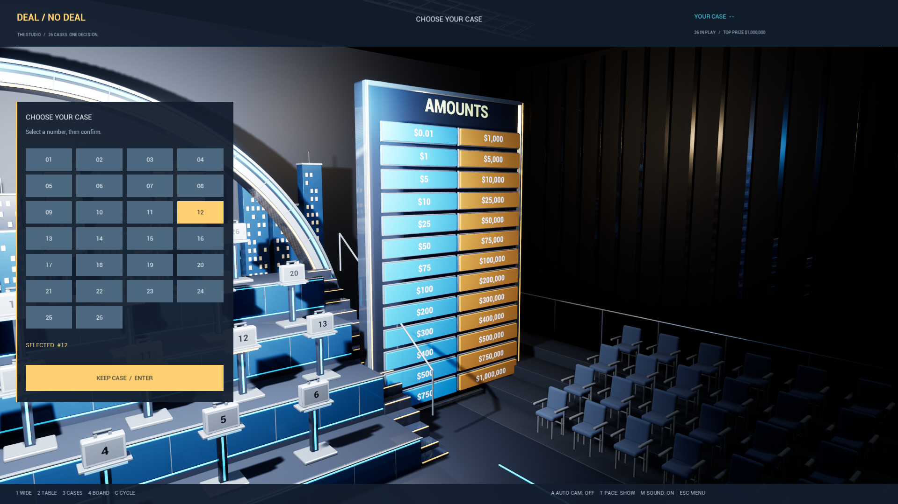
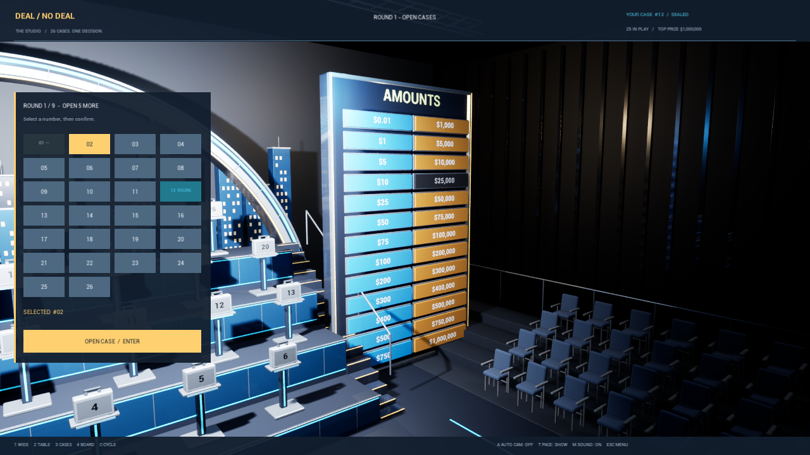

# Studio 0.4.1 — Cam 4 packaged verification

Validated on 2026-09-06 using the actual Win64 Development package, with rendering enabled and seed `20260906`.
The Editor build and BuildCookRun both succeeded. The cook reported zero errors and warnings.

## Fix

The bottom case tray covered the lowest prize tiles in Cam 4. In this camera, a four-column left panel now contains all 26 choices and the confirmation button. Camera position and field of view are unchanged. Leaving Cam 4 holds the sidebar for 0.8 seconds during the camera blend, then restores the ordinary bottom tray.

## Packaged checks

| Run | Exit code | Runtime errors | Result |
| --- | --- | --- | --- |
| Cam4-Packaged-1280 | 0 | 0 | PASS |
| Cam4-Packaged-1600 | 0 | 0 | PASS |
| Cam4-Packaged-1920 | 0 | 0 | PASS |
| Cam4-Packaged-Experience | 0 | 0 | PASS |
| Cam4-Packaged-NoDeal | 0 | 0 | PASS |
| Cam4-Packaged-Accept | 0 | 0 | PASS |

At each of the three tested 16:9 resolutions (1280×720, 1600×900, 1920×1080), the regression projects all 26 actual prize tiles and checks that none intersects the selection panel background or leaves the unobstructed viewport. It also drives actual HUD hitboxes to preview and keep case 12, open case 1, verify disabled owned/opened slots, and return to the regular bottom tray. The layout assertions run during initial selection, open-case selection and after opening.

The experience regression covers confirmation, replay, final keep/swap choices, phone calls and pause behavior. Separate packaged routes complete No Deal and first-offer acceptance. All six runs returned their expected success markers; runtime logs contained zero error, fatal, assertion or ensure failures.

Screenshots were captured from the packaged renderer. Visual review confirmed the bottom `$750` and `$1,000,000` tiles and legible controls, and checked the restored bottom tray. Twelve captures are retained in `Screenshots/`. Other aspect ratios were not covered by this release's layout regression.

## Download integrity

- ZIP: `DealOrNoDealStage-Studio-0.4.1-Windows.zip`
- Compressed bytes: 279,910,863
- Runtime files: 45; runtime bytes: 535,150,270
- ZIP CRC validation: PASS
- ZIP SHA-256: `efb649029449f3b6a24aaaf7f8e158c6babf9e757d822a8ef9c5f409d9fa5eab`
- Packaged game binary SHA-256: `60b71464136eb34563613aab087361cfaf4f859bde1b3c509feaef706f1cdb82`

The archive contains the complete portable `Windows/` runtime and bilingual launch instructions, excluding local test output and debug symbols. Extract the whole archive and launch `Windows/DealOrNoDealStage.exe`.

Reproduce with `Scripts/Verify-Cam4Package.ps1` after packaging. Machine-readable evidence is in [Cam4FixValidation.json](Cam4FixValidation.json). The older [Validation.md](Validation.md) and [Validation.json](Validation.json) retain historical 0.4 checks.
