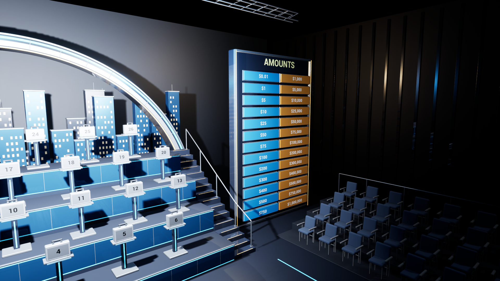
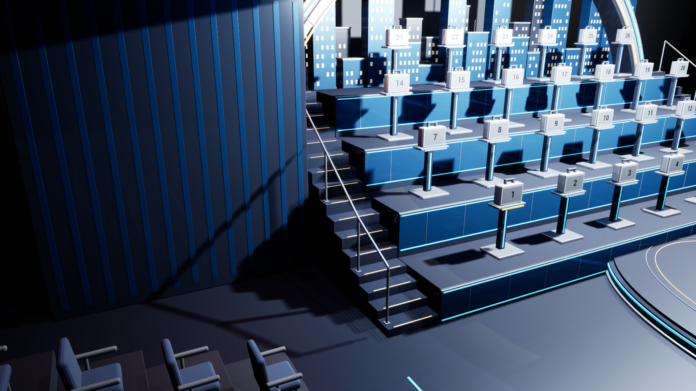
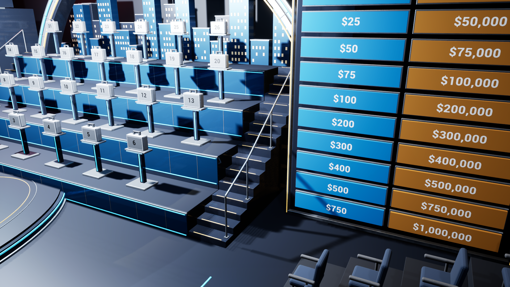

# Studio 0.4.2 — geometry and packaged verification

Validated on 2026-09-07 using the actual Windows Development package. The geometry source, Blender scene, FBX exports, imported Unreal meshes and cooked map were regenerated together.

## Problem and correction

The display enclosure at Y=760 cm intruded into the right access stair. Both handrails used posts outside their supporting treads, with elevated bases. The first access flight had unequal risers, the first show tier's trim extended below the floor, and side-bleacher bases extended into the display and Banker scenery.

- Move the display enclosure and its 26 interactive amount tiles together to center Y=895 cm. The original camera transforms and FOVs remain unchanged.
- Rebuild both access stairs as 16 continuous treads, 30 cm going and 88 cm width. The first flight rises 14.125 cm per tread and later flights rise 20 cm per tread. Every fourth tread aligns with the finished show-tier surface.
- Mount five posts per side on flanges contained by real tread surfaces. The continuous rail follows the treads at 90 cm above their centers.
- Shorten the first fascia and its joints/lights to remain above the floor.
- Stop side-bleacher bases at X=270 cm, beyond the last seat. Preserve all 177 chairs and all 26 cases.

## Geometry evidence

All 25 source checks passed. These measure actual transformed Blender mesh vertices and verify flange support, each access flight and five unrelated scenery pairs. Measured minimum separating-axis gaps are approximately:

| Mesh pair | Separation |
| --- | --- |
| Case terraces / display housing | 53 cm along Y |
| Case terraces / Banker suite | 6 cm along Y |
| Case terraces / arch and skyline | 32 cm along X |
| Audience architecture / display housing | 119.5 cm along X |
| Audience architecture / Banker suite | 95 cm along X |

The packaged layout test independently checks the actual loaded mesh bounds for the same five pairs, protecting against stale imports or displaced actors. These are scenery-envelope separation checks; they do not assert that intentional joints inside an assembly never overlap.

## Packaged checks

| Run | Exit code | Runtime errors | Result |
| --- | --- | --- | --- |
| Cam4-Packaged-1280 | 0 | 0 | PASS |
| Cam4-Packaged-1600 | 0 | 0 | PASS |
| Cam4-Packaged-1920 | 0 | 0 | PASS |
| Cam4-Packaged-Experience | 0 | 0 | PASS |
| Cam4-Packaged-NoDeal | 0 | 0 | PASS |
| Cam4-Packaged-Accept | 0 | 0 | PASS |

At 1280×720, 1600×900 and 1920×1080, the regression projects all 26 amount tiles and checks viewport fit and selection-panel clearance. Actual HUD hitboxes drive case preview, confirmation, opening, disabled owned/opened slots and camera switching. The other three runs cover experience behavior, a complete No Deal route and first-offer acceptance.

Five additional clean renders cover the wide stage, case terraces, amount board and both access stairs. All captures completed without error/fatal/assertion/ensure log entries. Seventeen correctly sized packaged screenshots are preserved in `Screenshots/0.4.2/`.

The renderer retains physical shadows and perspective occlusion between separate objects. Verification covers the listed mesh intersections and unsupported attachments, with rendered review from the five capture views. Other aspect ratios were not covered by this release's layout regression.

## Reproduce and verify the download

Regenerate with `ArtSource/build_studio.py`, compile the Editor target, run `Content/Python/build_studio.py`, and package Win64. Then run `Scripts/Verify-GeometryRelease.ps1`. Source geometry evidence is in `ArtSource/Export/geometry-validation.json`; complete machine-readable release results are in [GeometryFixValidation.json](GeometryFixValidation.json).

- Archive: `DealOrNoDealStage-Studio-0.4.2-Windows.zip`
- ZIP bytes: 280,572,217; runtime bytes: 535,925,514
- ZIP CRC validation: PASS
- ZIP SHA-256: `37d53f9245adc419f995e1c90f580e761a0d10cbed960a044653f4aed20fb230`
- Game binary SHA-256: `656df7dad0ef75d7b36c1de882ef8edd4801ceafc038782e28f0c3f4a31e6b7d`

Extract the complete archive and run `Windows/DealOrNoDealStage.exe`. Debug symbols and local test output are excluded. `Scripts/Install-DesktopShortcut.ps1` updates the local desktop entry using the original custom application icon.
