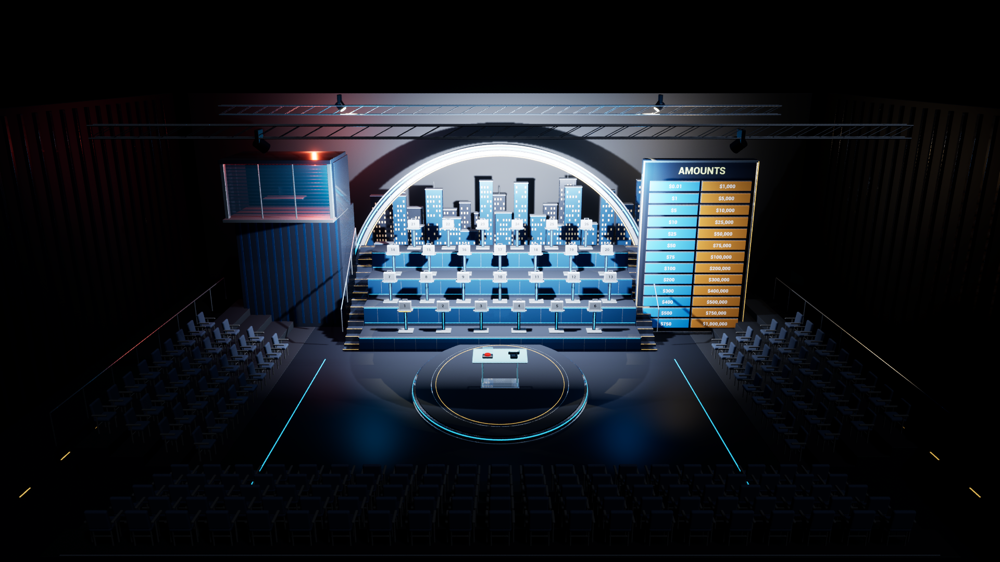

# Deal or No Deal — Studio Experience 0.4.2

An editable Unreal Engine 5.7 television studio and a complete playable briefcase game, developed from the classic 2006–2008 Culver Studios layout. The set contains no people. Dimensions are design assumptions inherited from the original graybox; this is an interpretation, not a surveyed replica.

## Play

Download the portable Windows game from [Release v0.4.2](https://github.com/JunjieNian/DealOrNoDeal/releases/tag/v0.4.2), extract the ZIP, and launch `Windows/DealOrNoDealStage.exe`.
Local builds launch from `Builds/DealOrNoDealStage-Studio-0.4.2/Windows/DealOrNoDealStage.exe`, or `Launch Studio.cmd`.
Copy the entire Windows folder when moving the portable game to another machine. The previous 0.3 build is kept separately. Packaged binaries are ignored by Git.

1. Keep one of 26 sealed cases, using the stage or the numbered selection tray.
2. Open 6, 5, 4, 3, 2, 1, 1, 1, 1 cases over nine rounds.
3. Answer the Banker and accept a guaranteed offer, or continue playing.
4. At the final two, keep your case or swap before the result is revealed.

Mouse selection previews a case before confirmation. Arrow keys and Enter work throughout selection; D/N handle offers and final choices. Escape opens the pause menu. R replays after a result, and cannot accidentally reset an active game.

Cam 4 places case selection in a compact left panel so all 26 prizes, including the bottom row, remain visible. Other cameras use the bottom selection tray. Version 0.4.2 separates the display from the access stairs, anchors both handrails to real treads and removes intersecting bleacher extensions. See [the geometry and packaged regression report](Documentation/GeometryFixValidation.md).

| Control | Action |
| --- | --- |
| 1 / 2 / 3 / 4; C | Wide / table / case terraces / prize board; cycle views |
| Enter / Space | Confirm selection, answer call, continue reveal |
| D / N | Deal / No Deal; keep / swap at the final two |
| Esc | Pause menu, or cancel an offer confirmation |
| M / T / A | Toggle sound / reveal pace / automatic cameras |
| F5 | High / Epic graphics |
| F11 / Alt+Enter | Full screen |

## The studio

The level retains ten independent runtime modules and adds nine editable groups of authored architecture: studio shell, central platform, phone, case terraces, arch and skyline, Banker suite, amount display, audience architecture and truss. The 26 case bodies/lids and 177 instanced chairs share reusable meshes.

Manufactured edges, aluminium/chrome finishes, smoked and clear glass, upholstery, stepped access, handrails, practical strips, restrained sound cues, smooth camera movement and animated box lids replace the earlier floating-case graybox. Lighting cues retain neutral key lighting so case numbers and prizes stay legible.

## Edit and regenerate

Open `DealOrNoDealStage.uproject` in Unreal Engine 5.7. The default map is `/Game/Maps/MainStage`.

- `ArtSource/DealStudio.blend`: editable Blender scene.
- `ArtSource/build_studio.py`: deterministic geometry and original audio generator.
- `ArtSource/Export/`: FBX meshes and the material recipe.
- `Content/Python/build_studio.py`: import materials/meshes/audio and regenerate the studio.
- `Content/Python/build_stage.py`: original ten-module assembly, reused by the studio generator.
- `Source/DealOrNoDealStage/DealStageModules.*`: stage, lighting, cameras and game rules.
- `Source/DealOrNoDealStage/DealStageExperience.cpp`: experience controls, responsive HUD and regressions.

After compiling the Editor target, run UnrealEditor-Cmd with this project's `-ExecutePythonScript=<absolute path to Content/Python/build_studio.py>`. Use `-StudioSkipImport` to rebuild the map without reimporting meshes or audio. Keep rendering and audio enabled for asset import on Unreal 5.7.

The project uses engine-native rendering plus original geometry and sound. It has no external asset download or runtime network dependency. See [the experience notes](Documentation/StudioExperience.md) for detailed controls, assumptions, regeneration and verification.
